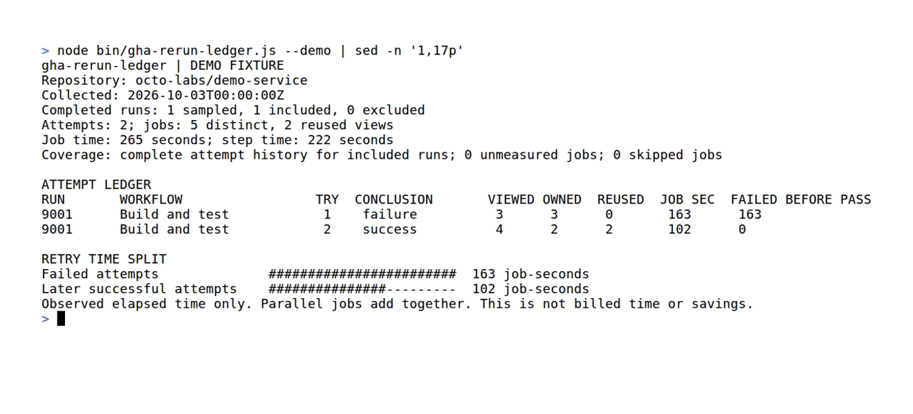

<h1 align="center">
  <br>
  gha-rerun-ledger
</h1>

<p align="center">
  <strong>Account for GitHub Actions reruns, then replay the report offline.</strong>
</p>

<p align="center">
  <a href="https://github.com/Arthur031221/gha-rerun-ledger/stargazers"></a>
  <a href="https://github.com/Arthur031221/gha-rerun-ledger/actions/workflows/ci.yml"></a>
  <a href="LICENSE"></a>
</p>

<p align="center">
  <a href="#quickstart">Quickstart</a> |
  <a href="#how-it-works">How it works</a> |
  <a href="#examples">Examples</a> |
  <a href="#faq">FAQ</a>
</p>

> [!TIP]
> Try the synthetic demo from GitHub without adding the package to your project:
> ```sh
> npx --yes github:Arthur031221/gha-rerun-ledger --demo
> ```

<p align="center">
  
</p>

## Why gha-rerun-ledger

Reruns have attempt history, but summaries can hide which attempt owned a job and how much elapsed job time was observed. This CLI writes one row for each observed attempt and saves the metadata needed to replay the report offline.

The ledger assigns each distinct job ID to its first observed attempt. Repeated records must agree before they count as carried work. Skipped jobs, missing intervals, empty attempts, inferred owners, and excluded runs remain visible in coverage.

[gha-doctor](https://github.com/linnea-bakshi/gha-doctor) is a maintained broad audit tool. Its README documents same-commit failure and pass analysis, slow-step history, and recommendations. gha-rerun-ledger focuses on an explicit per-attempt ledger and saved metadata replay. The projects have different scopes. This report does not establish that a retry was flaky or wasted.

## Features

- **Per-attempt ledger:** records the conclusion, viewed and owned job counts, carried records, measured seconds, and source links for each observed attempt.
- **Checked job reuse:** counts a repeated job ID once and rejects conflicting copies or incomplete attempt history.
- **Coverage counts:** keeps skipped, unmeasured, empty, inferred, and excluded records visible beside the totals.
- **Separate time views:** ranks workflows, jobs, runner label sets, and measured steps without adding step time to job time.
- **Offline replay:** save API metadata with `--save-snapshot`, then use `--input` to rebuild the report without a network request.
- **JSON and Markdown:** write JSON to stdout or save a readable Markdown report with attempt and job links.

## Quickstart

After downloading the package, the labeled synthetic demo runs without Git, `gh`, credentials, or network access.

```sh
npx --yes github:Arthur031221/gha-rerun-ledger --demo
```

From a checkout, the same report runs with:

```sh
node bin/gha-rerun-ledger.js --demo
```

After authenticating the GitHub CLI with read access to Actions, collect recent completed runs for a repository and save the snapshot:

```sh
npx --yes github:Arthur031221/gha-rerun-ledger --repo cli/cli --limit 1 --save-snapshot attempts.json --markdown report.md
```

Replace `cli/cli` with your `github.com` repository. This example samples one completed run. Live collection uses `gh api` GET requests. It does not post or modify repository data.

## Examples

Replay the packaged demo snapshot locally:

```sh
node bin/gha-rerun-ledger.js --input fixtures/demo-snapshot.json --json
```

Collect once, then inspect the same metadata as text, JSON, or Markdown:

```sh
npx --yes github:Arthur031221/gha-rerun-ledger --repo cli/cli --limit 1 --save-snapshot attempts.json
npx --yes github:Arthur031221/gha-rerun-ledger --input attempts.json
npx --yes github:Arthur031221/gha-rerun-ledger --input attempts.json --json > report.json
npx --yes github:Arthur031221/gha-rerun-ledger --input attempts.json --markdown report.md
npx --yes github:Arthur031221/gha-rerun-ledger --demo
```

Five lines from the synthetic `--demo` report:

```text
Attempts: 2; jobs: 5 distinct, 2 reused views
Job time: 265 seconds; step time: 222 seconds
9001      Build and test            1    failure          3      3      0       163      163
9001      Build and test            2    success          4      2      2       102      0
Failed attempts              ########################  163 job-seconds
```

The fixture records 163 seconds on the failed attempt and 102 seconds on the later success. Those are sums of distinct job intervals. Parallel jobs add together, so the totals are not workflow wall time or billed minutes.

## How it works

Live collection requests up to 20 recent completed workflow runs by default. Set `--limit` from 1 through 100 to change the sample size. For each included run, the CLI reads attempt metadata and every jobs page for attempts 1 through the current attempt number. It then reads the parent run again. If the run identity, commit, latest attempt, status, or conclusion changed during collection, the scan fails rather than guessing.

Snapshots keep the before and after parent metadata, each attempt response, page numbers and totals, and the returned job rows. Replay validates that attempts and pages are complete before calculating totals. A repeated job ID belongs to its first observed attempt. Its name, owner, status, labels, timestamps, and steps must agree in later views.

A job interval is `completed_at` minus `started_at` when both values are valid timestamps and the result is not negative. A missing or invalid interval is unmeasured, not zero. Skipped jobs are reported separately. Equal timestamps count as a measured zero and do not appear in rankings. Step intervals use the same rule and remain separate from job totals.

### Reading failed-before-pass time

The report classifies an attempt as failed before a pass only when its conclusion is `failure`, `timed_out`, or `startup_failure` and a later attempt of the same run succeeds. It sums the distinct job intervals owned by the failed attempt, including jobs that succeeded alongside the failed job. Cancelled attempt time is listed separately. This is observed historical job time to investigate, not proof of flaky tests, unnecessary work, saved time, or a cost estimate.

### Comparison

| Tool | Documented focus | gha-rerun-ledger report |
| --- | --- | --- |
| [gha-doctor](https://github.com/linnea-bakshi/gha-doctor) | Broad Actions audit with same-commit failure and pass analysis, slow-step history, and recommendations. | Keeps a per-attempt ledger and a metadata snapshot for offline replay. |
| [gh-actions-usage](https://github.com/codiform/gh-actions-usage) | Elapsed job-time totals for a selected billing period. Its README counts the latest attempt for a rerun job. | Samples recent completed runs and retains separate rows for observed attempts. It does not calculate billing-period totals. |

The comparison describes documented scope. gha-rerun-ledger does not claim that either tool lacks snapshot or retry features beyond those statements.

<details>
<summary><b>Options and report fields</b></summary>

| Option | Effect |
| --- | --- |
| `--repo owner/name` | Select a `github.com` repository. Without it, live mode reads `remote.origin.url` and accepts GitHub origins only. |
| `--limit N` | Sample 1 to 100 recent completed workflow runs. The default is 20. |
| `--save-snapshot FILE` | Save live API metadata as schema version 1 JSON. |
| `--input FILE` | Validate and replay a schema version 1 snapshot offline. |
| `--demo` | Run the synthetic fixture without Git, `gh`, credentials, or network access. |
| `--json` | Write the report as JSON to stdout. |
| `--markdown FILE` | Save a Markdown report. |
| `--help`, `--version` | Print command help or the package version. |

Exit status is 0 for a report and 2 for usage, collection, or snapshot errors. A valid report can still contain exclusions or timing gaps; check its coverage and warnings.

Snapshots retain run and job API responses, including repository, workflow, branch, job and step names, commit and actor metadata, labels, conclusions, and timestamps. The CLI does not request log files or save authentication headers. Check the retained metadata before sharing a snapshot.

</details>

<details>
<summary><b>CI usage</b></summary>

The test workflow runs `npm ci` and `npm test` on Node.js 20, 22, 24, and 26. These test commands do not need `gh`, `GH_TOKEN`, or GitHub API access.

For live collection in a workflow, grant the job read access to Actions and pass its token to GitHub CLI as `GH_TOKEN`. Do not put the token in a report or snapshot. The CLI sends GET requests only.

</details>

<details id="faq">
<summary><b>FAQ</b></summary>

**Does job time equal billed time?** No. The report sums elapsed job intervals. It does not apply billing rounding, runner multipliers, free-minute allowances, or plan rates.

**Does a failed-before-pass result mean flaky tests?** No. It shows a failed attempt followed by a successful attempt for the same workflow run, commit, and workflow. It does not inspect test outcomes or prove why the earlier attempt failed.

**What is outside the sample?** The scan covers up to the requested number of recent completed runs. It is not a date-window report or a repository-wide audit. Runs above 20 attempts are excluded as a whole and appear in coverage warnings.

**Why can a job have no duration?** The API row may lack a valid start or completion time, or the interval may run backwards. The job stays in coverage as unmeasured.

**Can I replay without GitHub access?** Yes. Use `--input FILE` with a saved snapshot. `--demo` also works offline.

</details>

## Contributing

Run `npm ci` and `npm test` before sending a change. See [CONTRIBUTING.md](CONTRIBUTING.md) for test and media instructions. Report defects through [GitHub issues](https://github.com/Arthur031221/gha-rerun-ledger/issues).

## License

The code is MIT licensed. See [LICENSE](LICENSE). Bundled fonts retain their notices under [assets/fonts](assets/fonts).
